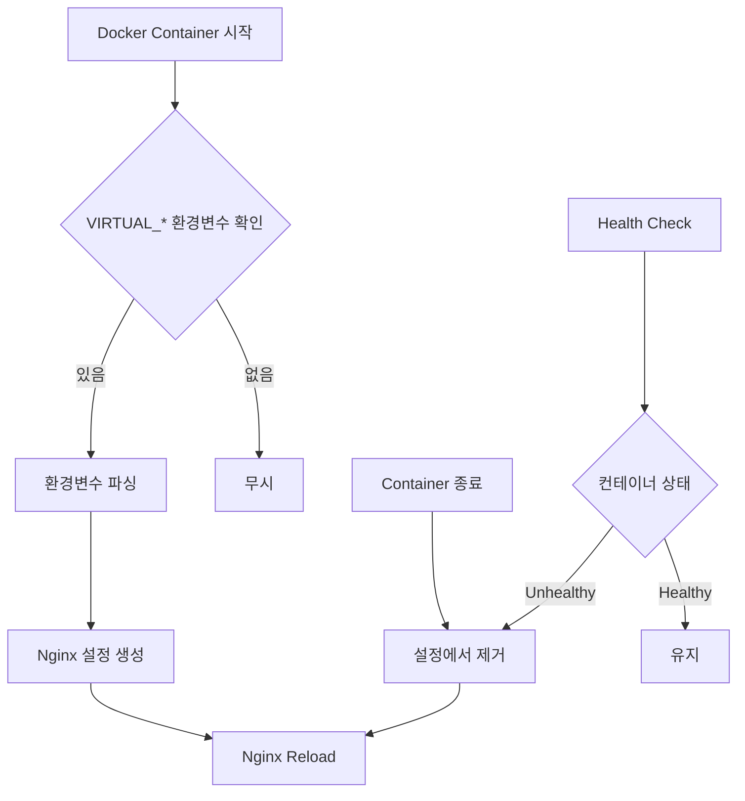

# nginx-proxy-watch

Docker 컨테이너 이벤트를 모니터링하고 Nginx 설정을 자동으로 생성하는 동적 리버스 프록시 서비스입니다.

## 목차

- [개요](#개요)
- [주요 기능](#주요-기능)
- [작동 원리](#작동-원리)
- [시작하기](#시작하기)
- [환경 변수 설정](#환경-변수-설정)
- [API 엔드포인트](#api-엔드포인트)
- [아키텍처](#아키텍처)
- [개발 및 테스트](#개발-및-테스트)
- [모니터링 및 디버깅](#모니터링-및-디버깅)
- [운영 가이드](#운영-가이드)
- [문제 해결](#문제-해결)

## 개요

nginx-proxy-watch는 마이크로서비스 환경에서 Docker 컨테이너의 라이프사이클에 따라 Nginx 리버스 프록시 설정을 자동으로 관리합니다. 컨테이너가 시작되거나 종료될 때 자동으로 Nginx 설정을 업데이트하여, 수동 설정 없이도 동적인 라우팅을 제공합니다.

### 핵심 이점

- **자동화**: 컨테이너 환경 변수만으로 프록시 설정 자동 생성
- **무중단**: 컨테이너 추가/제거 시 서비스 중단 없이 설정 갱신
- **확장성**: 동일 서비스의 여러 인스턴스 자동 로드밸런싱
- **유연성**: 도메인, 경로, 쿠키 기반 라우팅 지원

## 주요 기능

### 1. Docker 이벤트 모니터링
- 실시간 컨테이너 라이프사이클 이벤트 감지 (start, stop, die, destroy 등)
- Docker API 연결 실패 시 자동 재연결
- 시작 시 기존 실행 중인 컨테이너 자동 발견

### 2. 동적 Nginx 설정 생성
- EJS 템플릿 기반 설정 파일 자동 생성
- upstream, vhost, location 블록 동적 관리
- 설정 변경 시 자동 reload (무중단)

### 3. 다양한 라우팅 옵션
- **도메인 기반**: `VIRTUAL_HOST`로 도메인별 라우팅
- **경로 기반**: `VIRTUAL_LOCATION_PATH`로 URL 경로별 라우팅
- **쿠키 기반**: `VIRTUAL_COOKIE_NAME`으로 쿠키 값에 따른 라우팅
- **그룹 호스팅**: 여러 서비스를 하나의 도메인 아래 경로로 구성

### 4. SSL/TLS 지원
- 인증서 자동 감지 및 적용
- HTTP → HTTPS 자동 리다이렉트
- HTTP/2 지원

### 5. 헬스체크 및 모니터링
- 컨테이너 상태 주기적 확인
- 비정상 컨테이너 자동 제외
- REST API를 통한 실시간 상태 조회
- Required servers 검증 (필수 서비스 가용성 보장)

## 작동 원리



1. **컨테이너 감지**: Docker API를 통해 컨테이너 이벤트 구독
2. **설정 추출**: `VIRTUAL_` 접두사를 가진 환경 변수 분석
3. **템플릿 처리**: EJS 템플릿으로 Nginx 설정 파일 생성
4. **설정 적용**: Nginx configuration test 후 reload
5. **상태 모니터링**: 주기적 헬스체크로 설정 최신화

## 시작하기

### 사전 요구사항

- Docker 및 Docker Compose
- Node.js 20.x (개발 환경)
- Make (개발 도구)

### 빠른 시작

```bash
# 1. 저장소 클론
git clone https://github.com/your-org/nginx-proxy-watch.git
cd nginx-proxy-watch

# 2. 개발 환경 설정
make setup
make setup-hosts  # /etc/hosts에 테스트 도메인 추가 (sudo 필요)

# 3. 테스트 환경 시작
make start-full  # 모니터링 포함 전체 환경 시작

# 4. 상태 확인
make status

# 5. 모니터링 (새 터미널에서)
make monitor
```

### Docker Compose 예제

```yaml
version: '3'

services:
  nginx-proxy:
    image: nginx-proxy-watch:latest
    ports:
      - "80:80"
      - "443:443"
      - "18080:8080"  # API HTTP 서버 (외부:내부)
      - "18443:8443"  # API HTTPS 서버 (외부:내부)
    volumes:
      - /var/run/docker.sock:/var/run/docker.sock:ro
      - ./certs:/etc/nginx/certs:ro
      - ./api-certs:/app/dist/certs:ro  # API HTTPS 인증서
    environment:
      - API_PORT=8080
      - API_HTTPS_PORT=8443
      - LOG_LEVEL=info
      # API_HTTPS_ENABLED=true (기본값이므로 생략 가능)

  web-app:
    image: my-web-app
    environment:
      - VIRTUAL_HOST=example.com
      - VIRTUAL_PORT=3000
      - VIRTUAL_SSL=example.com
      - VIRTUAL_CERT=pem
```

## 환경 변수 설정

### nginx-proxy-watch 서비스 환경 변수

| 변수명 | 기본값 | 설명 |
|--------|--------|------|
| `API_PORT` | 8080 | API HTTP 서버 포트 |
| `API_HTTPS_ENABLED` | true | API HTTPS 서버 활성화 여부 |
| `API_HTTPS_PORT` | 8443 | API HTTPS 서버 포트 |
| `API_HTTPS_CERT_PATH` | /dist/certs/shop.co.kr_crt.pem | HTTPS 인증서 파일 경로 |
| `API_HTTPS_KEY_PATH` | /dist/certs/shop.co.kr_key.pem | HTTPS 개인키 파일 경로 |
| `LOG_LEVEL` | info | 로그 레벨 (error, warn, info, debug) |
| `NGINX_DHPARAM` | /etc/nginx/dhparam/dhparam.pem | DH 파라미터 파일 경로 |

### 컨테이너 환경 변수 (VIRTUAL_*)

#### 기본 설정

| 변수명 | 필수 | 기본값 | 설명 | 예시 |
|--------|------|--------|------|------|
| `VIRTUAL_HOST` | ✓ | - | 서비스 도메인 | `example.com` |
| `VIRTUAL_PORT` | | 80 | 컨테이너 내부 포트 | `3000` |
| `VIRTUAL_SSL` | | - | SSL 인증서를 사용할 도메인 | `example.com` |
| `VIRTUAL_CERT` | | - | 인증서 타입 | `pem` 또는 `crt` |

#### 그룹/경로 라우팅

| 변수명 | 설명 | 예시 |
|--------|------|------|
| `VIRTUAL_GROUP_HOST` | 그룹화할 호스트 도메인 | `api.example.com` |
| `VIRTUAL_LOCATION_PATH` | 그룹 내 경로 | `/users` |
| `VIRTUAL_IS_LOCATION` | 위치 기반 서비스 여부 | `Y` |
| `VIRTUAL_LOCATION` | 다중 위치 설정 | `api.example.com:/v1,api.example.com:/v2` |

#### 쿠키 기반 라우팅

| 변수명 | 설명 | 예시 |
|--------|------|------|
| `VIRTUAL_COOKIE_NAME` | 라우팅에 사용할 쿠키 이름 | `hospital_id` |
| `VIRTUAL_ROUTING_MAP` | 쿠키 값과 upstream 매핑 | `1:hospital-a,2:hospital-b` |
| `VIRTUAL_DEFAULT_UPSTREAM` | 기본 upstream | `hospital-default` |

### 설정 예제

#### 1. 기본 웹 서비스
```yaml
environment:
  - VIRTUAL_HOST=myapp.com
  - VIRTUAL_PORT=8000
```

#### 2. SSL 적용 서비스
```yaml
environment:
  - VIRTUAL_HOST=secure.example.com
  - VIRTUAL_PORT=3000
  - VIRTUAL_SSL=secure.example.com
  - VIRTUAL_CERT=pem
volumes:
  - ./certs:/etc/nginx/certs:ro
```

#### 3. API 그룹 서비스
```yaml
# User Service
user-service:
  environment:
    - VIRTUAL_GROUP_HOST=api.example.com
    - VIRTUAL_LOCATION_PATH=/users
    - VIRTUAL_PORT=3001

# Product Service  
product-service:
  environment:
    - VIRTUAL_GROUP_HOST=api.example.com
    - VIRTUAL_LOCATION_PATH=/products
    - VIRTUAL_PORT=3002
```

#### 4. 쿠키 기반 라우팅 (멀티테넌트)
```yaml
environment:
  - VIRTUAL_HOST=app.example.com
  - VIRTUAL_COOKIE_NAME=tenant_id
  - VIRTUAL_ROUTING_MAP=1:tenant-a,2:tenant-b,3:tenant-c
  - VIRTUAL_DEFAULT_UPSTREAM=tenant-default
```

## API 엔드포인트

API 서버는 기본적으로 8080 포트에서 실행됩니다.

### 헬스체크 및 상태

| 엔드포인트 | 메소드 | 설명 | 응답 예시 |
|------------|--------|------|-----------|
| `/` | GET | API 정보 및 사용 가능한 엔드포인트 목록 | `{ "service": "nginx-proxy-watch", "endpoints": [...] }` |
| `/health` | GET | 전체 시스템 헬스 상태 | `{ "status": "healthy", "required_servers": {...} }` |
| `/status` | GET | 상세 시스템 상태 페이지 | HTML 상태 페이지 |
| `/services/health` | GET | 모든 서비스의 상세 헬스 정보 | `{ "status": "healthy", "services": {...} }` |

### 컨테이너 정보

| 엔드포인트 | 메소드 | 설명 |
|------------|--------|------|
| `/containers` | GET | 관리 중인 모든 컨테이너 목록 |
| `/containers/:id/health` | GET | 특정 컨테이너의 헬스 상태 |

### 설정 검증

| 엔드포인트 | 메소드 | 설명 |
|------------|--------|------|
| `/nginx-config` | GET | Nginx 설정 유효성 검사 (`nginx -t`) |
| `/required-servers` | GET | 필수 서버 설정 조회 |
| `/required-servers/verify` | GET | 필수 서버 가용성 상세 검증 |

### API 사용 예제

```bash
# HTTP 헬스체크 (외부 포트)
curl http://localhost:18080/health

# HTTPS 헬스체크 (외부 포트, 자체 서명 인증서 무시)
curl -k https://localhost:18443/health

# HTTPS 헬스체크 (도메인 사용, *.shop.co.kr 인증서)
curl https://test.shop.co.kr:18443/health --resolve test.shop.co.kr:18443:127.0.0.1

# 컨테이너 목록 조회 (HTTP)
curl http://localhost:18080/containers | jq

# 컨테이너 목록 조회 (HTTPS)
curl -k https://localhost:18443/containers | jq

# HTTPS 상태 조회 (도메인 해석 포함)
curl https://test.shop.co.kr:18443/status --resolve test.shop.co.kr:18443:127.0.0.1 | jq

# 실제 서버 예시 (10.101.99.136)
curl http://10.101.99.136:18080/health
curl -k https://10.101.99.136:18443/health
curl https://test.shop.co.kr:18443/health --resolve test.shop.co.kr:18443:10.101.99.136

# 특정 컨테이너 상태
curl http://localhost:8080/containers/abc123/health

# Nginx 설정 검증
curl http://localhost:8080/nginx-config
```

## 아키텍처

### 핵심 컴포넌트

```
nginx-proxy-watch/
├── src/
│   ├── index.ts              # 메인 진입점
│   ├── api-server.ts         # REST API 서버
│   ├── event-handler.ts      # Docker 이벤트 처리
│   ├── watch.ts              # 컨테이너 감시 초기화
│   ├── health.ts             # 주기적 헬스체크
│   ├── health-checker.ts     # 헬스체크 로직
│   ├── state.ts              # 전역 상태 관리
│   └── util/
│       ├── container-config.ts    # 설정 파싱
│       ├── container-management.ts # 컨테이너 관리
│       └── logging.ts            # 로깅 시스템
├── templates/                # Nginx 설정 템플릿
│   ├── upstream-template.ejs
│   ├── vhost-template.ejs
│   ├── location-template.ejs
│   └── vhost-cookie-routing-template.ejs
└── conf/                     # 기본 설정 파일
```

### 데이터 흐름

1. **이벤트 수신**: Docker API → Event Handler
2. **설정 파싱**: Container Config Parser → State Manager
3. **템플릿 렌더링**: EJS Templates → Nginx Config Files
4. **설정 적용**: Config Validation → Nginx Reload
5. **상태 노출**: State → API Server → HTTP Response

### 상태 관리

- **In-Memory State**: 모든 컨테이너 정보를 메모리에 저장
- **Stateless Design**: 재시작 시 전체 상태 재구성
- **Event-Driven Updates**: Docker 이벤트에 의한 실시간 업데이트

## 개발 및 테스트

### 개발 환경 설정

```bash
# TypeScript 컴파일 및 실행
cd project
npm install
npm run dev

# Docker 이미지 빌드
make build

# 개발 중 컨테이너 쉘 접근
make shell
```

### 테스트 실행

```bash
# 전체 테스트 스위트
make test

# 개별 테스트
make test-restart    # 컨테이너 재시작 테스트
make test-scale      # 스케일링 테스트
make test-health     # 헬스체크 테스트
make test-network    # 네트워크 파티션 테스트
make test-chaos      # 카오스 엔지니어링 테스트
```

### 테스트 시나리오

테스트 환경은 다양한 실제 시나리오를 시뮬레이션합니다:

- **다중 도메인**: main, api, admin 서비스
- **로드밸런싱**: balance 서비스 (3개 인스턴스)
- **쿠키 라우팅**: hospital/pharmacy 멀티테넌트
- **그룹 서비스**: service-a, service-b 경로 라우팅
- **SSL 서비스**: secure 서비스
- **다중 경로**: multipath 서비스

## 모니터링 및 디버깅

### 로깅

로그 파일 위치:
- `/var/log/docker-event-watcher/watcher-*.log` - 전체 로그
- `/var/log/docker-event-watcher/error-*.log` - 오류 로그
- `/var/log/docker-event-watcher/debug-*.log` - 디버그 로그

로그 확인:
```bash
# 실시간 로그 모니터링
make logs

# 특정 컨테이너 로그
docker logs nginx-proxy-watch

# 로그 파일 직접 확인
tail -f /var/log/docker-event-watcher/watcher-$(date +%Y-%m-%d).log
```

### 모니터링 도구

```bash
# 실시간 대시보드
make monitor

# 시스템 상태
make status

# Nginx upstream 확인
make config-show

# 디버그 정보 수집
make debug
```

### 성능 모니터링

OpenTelemetry 통합:
```bash
# 모니터링 포함 시작
make start-full

# Jaeger UI 접근
http://localhost:16686
```

## 운영 가이드

### 프로덕션 배포

1. **리소스 요구사항**
   - CPU: 0.5 core 이상
   - Memory: 512MB 이상
   - Disk: 로그 저장 공간 확보

2. **보안 설정**
   - Docker 소켓은 읽기 전용으로 마운트
   - SSL 인증서는 별도 볼륨으로 관리
   - API 포트는 내부 네트워크만 접근 가능하도록 설정

3. **고가용성**
   - nginx-proxy-watch는 단일 인스턴스로 실행
   - Nginx 자체는 여러 worker로 고가용성 제공
   - 필수 서비스는 `REQUIRED_SERVERS` 환경변수로 모니터링

### 백업 및 복구

- **Stateless 설계**: 별도 백업 불필요
- **설정 재생성**: 재시작 시 자동으로 모든 설정 재구성
- **인증서 백업**: SSL 인증서만 별도 백업 필요

### 업그레이드

```bash
# 1. 새 이미지 빌드
make build

# 2. 기존 컨테이너 중지
docker stop nginx-proxy-watch

# 3. 새 버전 시작
docker run -d --name nginx-proxy-watch \
  -v /var/run/docker.sock:/var/run/docker.sock:ro \
  -p 80:80 -p 443:443 -p 8080:8080 \
  nginx-proxy-watch:latest
```

## 문제 해결

### 일반적인 문제

#### 1. 컨테이너가 프록시에 등록되지 않음

**확인사항:**
- `VIRTUAL_HOST` 환경변수 설정 여부
- 컨테이너가 같은 Docker 네트워크에 있는지
- 컨테이너가 실행 중인지

**디버깅:**
```bash
# 컨테이너 환경변수 확인
docker inspect <container_name> | jq '.[0].Config.Env'

# API로 상태 확인
curl http://localhost:8080/containers
```

#### 2. SSL 인증서가 적용되지 않음

**확인사항:**
- 인증서 파일이 올바른 위치에 있는지
- 인증서 파일명이 도메인과 일치하는지
- 인증서 권한이 올바른지

**인증서 위치:**
- PEM: `/etc/nginx/certs/<domain>.pem`, `/etc/nginx/certs/<domain>.key`
- CRT: `/etc/nginx/certs/<domain>.crt`, `/etc/nginx/certs/<domain>.key`

#### 3. 헬스체크 실패

**확인사항:**
- 컨테이너 내부 서비스가 정상 작동하는지
- `VIRTUAL_PORT`가 올바른지
- 네트워크 연결이 정상인지

**디버깅:**
```bash
# 컨테이너 헬스 상태
curl http://localhost:8080/containers/<container_id>/health

# 직접 연결 테스트
docker exec nginx-proxy-watch curl -I http://<container_ip>:<port>
```

### 로그 분석

주요 로그 패턴:

```bash
# Docker 이벤트 확인
grep "Docker event" /var/log/docker-event-watcher/watcher-*.log

# 설정 생성 확인
grep "nginxConfig" /var/log/docker-event-watcher/watcher-*.log

# 오류 확인
grep "ERROR" /var/log/docker-event-watcher/error-*.log
```

### 응급 조치

```bash
# Nginx 설정 검증
make config-test

# 설정 강제 재생성
docker exec nginx-proxy-watch rm -rf /etc/nginx/conf.d/*
docker restart nginx-proxy-watch

# 디버그 정보 수집
make debug > debug-$(date +%Y%m%d-%H%M%S).log
```

## 기여하기

1. Fork the repository
2. Create your feature branch (`git checkout -b feature/amazing-feature`)
3. Commit your changes (`git commit -m 'Add some amazing feature'`)
4. Push to the branch (`git push origin feature/amazing-feature`)
5. Open a Pull Request

## 라이선스

이 프로젝트는 MIT 라이선스 하에 배포됩니다.

## 연락처

- 프로젝트 관리자: [이메일]
- 이슈 트래커: [GitHub Issues URL]
- 위키: [프로젝트 위키 URL]